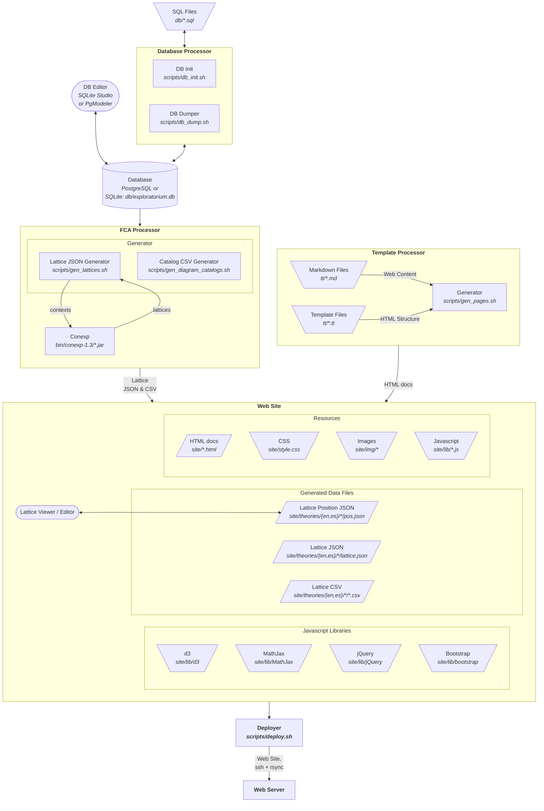

# Exploratorium

Website for the [Space-Time Theories
Exploratorium](https://remo.cua.uam.mx/vis/Exploratorium/).

The following is a graph of the main workflow. Trapezoids represent
files found in this GIT repo, most of which are input files. Skewed
boxes represent files resulting from the output of a process. Rounded
boxes represent user-facing applications that manipulate data. Normal
gray boxes represent a processor. Texts in italics indicate the
location of a file or the processor script/executable.

