# Exploratorium

Website for the [Space-Time Theories
Exploratorium](https://remo.cua.uam.mx/vis/Exploratorium/).


## Installation

The following instructions are for a Linux Debian 12.5 (Bookworm)
installation. For other OSes and/or Linux distributions, YMMV.

Install the required packages using this command:

```sh
sudo apt install openjdk-17-jre-headless openjdk-17-jre libjson-perl \
  libtemplate-perl libdbi-perl libdbd-sqlite3-perl libdigest-md5-perl \
  libinline-java-perl pandoc sqlite3 pgformatter rsync openssh-client \
  inkscape imagemagick-6.q16 node-http-server
```

For macOS, install the equivalent packages using [Homebrew](https://brew.sh/)

Install [SQLiteStudio](https://sqlitestudio.pl/) for user-facing
database editting and manipulation, or any alternative with which you
feel comfortable.

Check [deploy.sh usage](#deploysh) for the configuration requirements
for deployment.

In the near future, [PostgreSQL](https://www.postgresql.org/) will be
supported as an alternative to [SQLite](https://www.sqlite.org/), so
in some parts of the documentation we may refer to the database
platform in an abstract fashion or mention PostgreSQL as a side note.

### Observations

* All shell scripts have been written specifically for Bash.
* If you wish to execute Conexp in stand-alone mode, as an
  application, you will need to provide a JavaFX implementation to
  Conexp, either by installing a legacy version of Java (prior to Java
  11) or installing [OpenJFX](https://gluonhq.com/products/javafx/).
* `node-http-server` is in the package list as a means to load the web
  site locally for development. If you do not wish to install its
  dependencies, you can instead use `micro-httpd` or `mini-httpd` and
  edit
  [`scripts/command/http-server.command`](scripts/command/http-server.command)
  accordingly.
* `inkscape` and `imagemagick-6.q16` are required to process and
  generate the gravity apple tree. The part executed by
  [Inkscape](https://inkscape.org/) is a typeface-sensitive operation
  and should only be done with the same architecture/machine of the
  author's, otherwise the geometries will come out wrong and the graph
  will be malformed. There is no need to install these if the gravity
  tree will not be regenerated.


## Workflow

The following is a graph of the main workflow. Trapezoids represent
files found in this GIT repo, most of which are input files. Skewed
boxes represent files resulting from the output of a process. Rounded
boxes represent user-facing applications that manipulate data. Normal
gray boxes represent a processor. Texts in italics indicate the
location of a file or the processor script/executable.

```mermaid
flowchart TD
    SQL[\SQL Files<br/><i>db/*.sql/] <--> DBP
    subgraph DBP[<b>Database Processor]
        DBI[DB Init<br/><i>scripts/db_init.sh]
        DBD[DB Dumper<br/><i>scripts/db_dump.sh]
    end
    DBP <--> DB[(Database<br/><i>PostgreSQL or<br/>SQLite: db/exploratorium.db)]
    DB --> FCA
    DBC([DB Editor<br/><i>SQLite Studio<br/> or PgModeler]) <--> DB
    subgraph TTP[<b>Template Processor]
        TTGen[Generator<br/><i>scripts/gen_pages.sh]
        MD[\Markdown Files<br/><i>tt/*.md/] -- Web Content --> TTGen
        TT[\Template Files<br/><i>tt/*.tt/] -- HTML Structure --> TTGen
    end
    subgraph FCA[<b>FCA Processor]
        direction TB
        subgraph FG[Generator]
            G[Lattice JSON Generator<br/><i>scripts/gen_lattices.sh]
            G2[CSV Catalogs Generator<br/><i>scripts/gen_diagram_catalogs.sh]
        end
        CX[Conexp<br><i>bin/conexp-1.3/*.jar]
        G -- contexts --> CX
        CX -- lattices --> G
    end
    subgraph SITE[<b>Web Site]
        direction LR
        ED([Diagram Viewer / Editor])
        subgraph DAT[Generated Data Files]
            LJ[/"Lattice JSON<br/><i>site/theories/{en,es}/*/lattice.json</i>"/]
            CSV[/"CSV Catalogs<br/><i>site/theories/{en,es}/*/*.csv</i>"/]
            LPJ[/"Node Positions JSON<br/><i>site/theories/{en,es}/*/pos.json</i>"/]
        end
        subgraph LIB[Javascript Libraries]
            D3[\d3<br/><i>site/lib/d3/]
            MJ[\MathJax<br/><i>site/lib/MathJax/]
            JQ[\jQuery<br/><i>site/lib/jQuery/]
            BS[\Bootstrap<br/><i>site/lib/bootstrap/]
        end
        subgraph RES[Resources]
            HTML[/HTML docs<br/><i>site/*.html/]
            CSS[\CSS<br/><i>site/style.css/]
            I[\Images<br/><i>site/img/*/]
            JS[\Javascript<br/><i>site/lib/*.js/]
        end
        ED <---> LPJ
    end
    FCA -- Lattice<br/>JSON & CSV --> SITE
    TTP -- HTML docs --> SITE
    SITE --> DEP
    DEP[<b>Deployer<br/><i>scripts/deploy.sh]
    DEP -- Web Site,<br/>ssh + rsync --> SRV[<b>Web Server]
```




## Usage

The Exploratorium comes with a series of scripts that perform the
different transformation stages of the workflow. They are located in
the [scripts directory](scripts), inside of which there is a [commands
directory](scripts/commands) which contains the most common operations
and are meant to be executed from a file manager by double-clicking
(this functionality has been tested on macOS Finder and does not work
with GNOME Files v.43 where the best you can do is select an option by
right-clicking the .command file or installing and configuring
something like the [Command Menu
extension](https://extensions.gnome.org/extension/4850/command-menu/),
so YMMV).


### Generalities

All scripts auto-discover the location of the project directory by
assuming it to be the parent of the program's location, and they are
working-directory agnostic, meaning they can be executed from any
location and they will always act by default on the project of which
they are a part (unless `SCRIPTDIR` or `PROJECTDIR` is overriden, see
the following section).

#### Configuration and Overriding

The following environment variables can be set to customize the
transformation process:

| Name               | Default                         | Purpose                                                                                                                                                    |
|--------------------|---------------------------------|------------------------------------------------------------------------------------------------------------------------------------------------------------|
| `CONFIGFILE`       | `$SCRIPTDIR/config.sh`          | Configuration override by means of a sourced shell script. If the default config file is not found, it is not sourced                                      |
| `SCRIPTDIR`        | `$(dirname "$0")`               | Location of the script being invoked                                                                                                                       |
| `PROJECTDIR`       | `$SCRIPTDIR/..`                 | Location of the project's main directory                                                                                                                   |
| `DBDIR`            | `$PROJECTDIR/db`                | Location of the project's files related to the database, such as initialization SQL and data dumps, and in the case of SQLite, the database binary file    |
| `SITEDIR`          | `$PROJECTDIR/site`              | Location of the web site's files. This is the DocumentRoot for a local web server and what is deployed to production                                       |
| `DIAGRAMSUBDIR`    | `theories`                      | If `DIAGRAMDIR` is not overriden, sets the sub-directory under `$SITEDIR` where diagram files will be put                                                  |
| `DIAGRAMDIR`       | `$SITEDIR/$DIAGRAMSUBDIR/%s/%s` | Location where the diagram files will be put. First `%s` is replaced by the language code, and the second by the context name                              |
| `DIAGRAM_FILTERS`  | ` ` (no value)                  | Filters (grep regexps) separated by space selecting which diagrams will be worked on. No value selects all of them. See [gen_lattices.sh](#gen_latticessh) |
| `DEFAULT_DBDSN`    | `$DBDIR/exploratorium.db`       | Data store name for the database connection. DBI notation, or just the file name of an SQLite database file                                                |
| `MASTER_NAME`      | `master-%s.md`                  | Name scheme for the [master Markdown files](#master-markdowns) found in the [tt directory](tt). `%s` is replaced by the language code (i.e. `en` or `es`)  |
| `DEPLOY_HOST`      | `remo`                          | SSH Host where deployment is to connect to transfer the files of the web site. See [deploy.sh](#deploysh)                                                  |
| `DEPLOY_REMOTEDIR` | `Exploratorium`                 | Path inside the deployment host where the web site files will reside. See [deploy.sh](#deploysh)                                                           |

`DEFAULT_DBDSN` can point to a file, which selects SQLite as the
database engine. DBI notation is supported for future-proofing when
the string is prefixed with `DBI:`, as per usual. If credentials are
needed, an external method such as
[pgpass](https://www.postgresql.org/docs/current/libpq-pgpass.html) is
recommended. For programs that require a connection string (a DSN) as
a parameter, `DEFAULT_DBDSN` will be taken if none is provided.

If a configuration file is found where `CONFIGFILE` points it will be
sourced and the values of the environment variables set there will
override the default values. Only when `CONFIGFILE` is using its
default value will the sourcing be ommited if the file is not
found. Otherwise, an error will be produced. 

Note: the configuration file is sourced **twice**: once before, and
once after the configuration globals are set. Complex commands within
this file are discouraged.

Example `scripts/config.sh` file:

```sh
SITEDIR=$PROJECTDIR/test-site
DIAGRAMSUBDIR=cosmo
```

This will make `SITEDIR` derive its location from `PROJECTDIR`'s
default value, and make `DIAGRAMDIR` be `$SITEDIR/cosmo`. All other
variables will take their normal default values. Since the
configuration file is in the default location, it will provoke the
overrides automatically.

Of course, you can set or export these variables at the shell level,
for a one-off case and it's the only reliable way to indicate an
alternate configuration file location:

```sh
$ CONFIGFILE=/tmp/new-config.sh scripts/init.sh
```

or if you are using a configuration file for a whole session:

```sh
$ export CONFIGFILE=$HOME/.my-exploratorium-config.sh
$ scripts/gen_diagram_catalogs.sh
$ scripts/gen_lattices.sh
```


### Execution dependencies

The whole of the project is meant to be totally or partially rebuilt
using just one command without user intervention. To understand the
execution chain, examine the following dependency tree:


All of the above programs reside in the [scripts
directory](scripts). Scripts in rounded boxes are top-level programs
intended to be invoked by users.


### Top-level Operations

These are the most important programs to run while working on the
project. All of the other programs that these two invoke are specific
steps of the whole processing, but it is not really much more
productive to call them directly, so as an end-user, most of the
attention should be put on these programs, and the documentation of
the other, lower-level programs should be regarded as information for
development purposes or to isolate execution failures.

#### init.sh

This will take a project that has just been cloned from git,
[initialize the database](#db_initsh) and then [generate the whole web
site](#buildsh). It can be useful if changes to the database or other
sources have just been pulled from git and we want to regenerate the
whole thing.

This program will force the regeneration of all of the lattice files,
regardless of changes in the database. Otherwise, it's the equivalent
of just calling [db_init.sh](#db_initsh) and then
[build.sh](#buildsh), which is what is done when working in the
[database workflow](#database-workflow).

**Note: since this program invokes [db_init.sh](#db_initsh), it should
not be called if there are changes to the database that have not been
dumped back to SQL statements or these changes will be reverted to
what the SQL scripts indicate (although a backup is produced to
mitigate the damage in case this happens by accident). If there are
pending changes on the database ahd you want to see how these changes
look on the web page, use [build.sh](#buildsh)**

Invocation:

`init.sh [«DSN»]`

* `«DSN»`: optional Data Source Name, see [`DEFAULT_DBDSN`](#configuration-and-overriding).

#### build.sh

Assume the database is up and running and regenerate the whole web
site: [catalogs](#gen_diagram_catalogssh),
[lattices](#gen_latticessh) and [web pages](#gen_pagessh).

Invocation:

`build.sh [«DSN»]`

* `«DSN»`: optional Data Source Name, see [`DEFAULT_DBDSN`](#configuration-and-overriding).

Also, you can double-click or run
[scripts/commands/rebuild.command](scripts/commands/rebuild.command)
from your file browser if that is an available option.


#### deploy.sh

This program is used to upload all of `SITEDIR` to the production web
host (remo, or the value of
[`DEPLOY_HOST`](#configuration-and-overriding)). Your
`$HOME/.ssh/config` has to be correctly configured to perform the
transmission, which is done using rsync over an ssh connection for
performance: only those files that are detected as changed are
uploaded to the server.

Here is an example of an
[ssh_config](https://linux.die.net/man/5/ssh_config) section that
would make this work, assuming that the relevant asymetric keys have
been set up correctly for the default
[`DEPLOY_HOST`](#configuration-and-overriding):

```
Host remo
	Hostname remo.cua.uam.mx
	User remousr
	IdentityFile ~/.ssh/remo.rsa
```

Check any of many Internet tutorials on how to set up passwordless ssh
authentication through asymmetric keys to get everything set
up. Here's one from the University of Indiana on how to do it in [9
easy steps](https://kb.iu.edu/d/aews).

In some cases you may have to discuss ssh access and allowed
authentication methods with your production host administrator. If a
non-interactive access method is not arranged, you may have to provide
a password every time you deploy.

Invocation:

`deploy.sh`

* This program takes no arguments. Configuration is done through
  [`DEPLOY_HOST` and
  `DEPLOY_REMOTEDIR`](#configuration-and-overriding) environment
  variables.

### Database Operations

The chosen format for the database schema and data control in the git
repo is as SQL statemets. After the repository is cloned from git, the
database is not ready to be worked on: it must be restored from the
SQL scripts.

Conversely, a dump should be performed to convert the database to
plain-text SQL statement scripts for changes to be commited. SQL
output from the dump scripts is what is to be commited to the
repository, where it is easier to keep track of the changes, instead
of pushing binary files which are unnatural for git to manage.

#### Database Workflow

Here is a state diagram with the expected steps relative to working on
changes to the database:


##### Elaboration

* [db_init.sh](#db_initsh) should only be run if the database is not
  in place or if the data in the SQL files supercedes the one in the
  database. If there is work in the database pending to be dumped to
  SQL, this step should be skipped.
* Proceed to edit the database. In the future, there should be a
  [CRUD](https://en.wikipedia.org/wiki/Create,_read,_update_and_delete)
  application so that the database is not edited "by hand". For
  SQLite-based projects, we are using
  [SQLiteStudio](https://sqlitestudio.pl/).
* Run [build.sh](#buildsh) (or double-click
  [rebuild.command](scripts/commands/rebuild.command)) to regenerate
  the diagram CSV catalogs and/or the lattice JSON files as needed.
* Open the local website with your web browser and check the
  results. If the local web server is not up, firstly run
  [http-server.command](scripts/commands/http-server.command) and
  leave it there. The local server will show the access URL on the
  terminal, which should typically be <http://127.0.0.1:8080/>.
* Review your changes and go back to the database editor if more work
  needs to be done.
* If you are satisfied with the results, it's time to commit the
  canges to the git repository. Since the database is not directly
  stored on git and we are instead using SQL dumps for source control,
  run [db_dump.sh](#db_dumpsh) to export the database with the new
  data onto the SQL files.
* Proceed to commit and optionally push to git.
* If someone else has pushed changes to the SQL files, you will need
  to do a git pull, review the changes and then regenerate the
  database by running [db_init.sh](#dbinitsh) once again. This should not
  be a problem since you have already exported your own changes to the
  SQL files and reviewed any changes brought from the git pull.
  
#### Database Command Reference

##### db_init.sh

Take the SQL statements stored in `$DBDIR/ddl.sql` (SQL statements to
build the database schema) and `$DBDIR/data.sql` (data dumped as SQL
insert statements) and use them to set up a new database.

In the case of SQLite, if the database file already exists, it is
forcefully renamed to its original name plus `.bak` as an additional
suffix to avoid an irrecoverable loss of information in case there are
uncommited changes in the binary that haven't been dumped.

For DBMSes, a dump may be performed, then the database would be
dropped and recreated if possible, but this has its own caveats as
many DBs cannot be dropped if any client is connected to it.

Invocation:

`db_init.sh [«DSN»]`

* `«DSN»`: optional Data Source Name, see [`DEFAULT_DBDSN`](#configuration-and-overriding).

##### db_dump.sh

Dump both the [schema of the database](#db_dump_ddlsh) and [its
data](#db_dump_datash) and store them as SQL statements in
`$DBDIR/ddl.sql` and `$DBDIR/data.sql` respectively.

Invocation:

`db_dump.sh [«DSN»]`

* `«DSN»`: optional Data Source Name, see [`DEFAULT_DBDSN`](#configuration-and-overriding).

##### db_dump_ddl.sh

Perform a dump of the schema of the database and send it to standard
output. [`pg_format`](https://sqlformat.darold.net/) is used as a base
to beautify the output.

Invocation:

`db_dump_ddl.sh [«DSN»]`

* `«DSN»`: optional Data Source Name, see [`DEFAULT_DBDSN`](#configuration-and-overriding).

##### db_dump_data.sh

Dump the data from all of the tables and send them as INSERT SQL
statements to standard output.

Invocation:

`db_dump_data.sh [«DSN»]`

* `«DSN»`: optional Data Source Name, see [`DEFAULT_DBDSN`](#configuration-and-overriding).


### Web Site Operations

From the content creator's perspective, to render the web site's pages
and diagrams we have two main inputs: master Markdown files and the
database. For the webmaster, the template files affect the markup and
structure of the pages and of course there are CSS files, images and
Javascript sources to maintain.

The content creator needs only to invoke [build.sh](#buildsh) to
regenerate the web pages automatically after work has been done either
on the database or the master markdowns.

#### Web Content Workflow

Here is a state diagram with the expected steps for working on web
content:


##### Elaboration

* After running [build.sh](#buildsh) open the local website with your
  web browser and check the results. If the local web server is not
  up, firstly run
  [http-server.command](scripts/commands/http-server.command) and
  leave it there. The local server will show the access URL on the
  terminal, which should typically be <http://127.0.0.1:8080/>.

From here you can proceed to either:

* Work on the content of the site
  * Using a text editor, edit the master Markdown file for the desired
    language. A text editor capable of validating and previewing
    Markdown formatting is recommended.

or

* Visit a diagram page to enter editor mode and work on the diagram
  nodes positioning.
  * The editor button will only be available if the page is visited
    through address `127.0.0.1`.
  * After altering the node positions proceed to generate the positional
    JSON code, select the "Copy" button and using a text editor replace
    the content of the corresponding `pos.json` file with what has been
    copied.
  * After the modifying the size and offset of the diagram, copy the
    corresponding value and using a text editor open the corresponding
    `config.js` and replace the value of the `VIEWBOX` parameter.

* Run [build.sh](#buildsh) and review your changes. 
* If you are satisfied with the results, it's time to commit the
  canges to the git repository and optionally git push to upload the
  changes to the upstream repository (github).
* If someone else has pushed changes to the upstream repo, you will
  need to do a git pull, review the changes and then regenerate the
  site by running [build.sh](#buildsh) once again.

#### Master Markdowns

The web pages for the site are generated using [Markdown-formatted
plain text files](https://daringfireball.net/projects/markdown/) that
follow a bespoke document structure. Because the individual pages
behind the project are all relatively small, containing most of them
two or three parragraphs each, it is easier for the content creator to
edit just one file where all of the content is deposited.

##### Multi-language Support

Currently, only two languages are supported, which at the time are
being used for English and Spanish, but they could be any two
languages. Support for more languages would entail easy modifications
to the template system and the UI: make the language selector a pop-up
menu, and let the per-page `navlang` config variable be a JSON object,
instead of the current situation whre the language selector is just a
link that toggles the language and `navlang`'s value is a string with
the URL of the current page's alternate version in the "other"
language.

Languages are enumerated at the database level in the lang table. Each
language has a code, which is relevant at the file level. The system
allows for a configuration with only one language, and the database
does not limit the amount of languages that there can be: it's just a
matter of making template system accomodate more than two of them.

##### File Location

Master Markdown files are located inside the [`tt` directory](tt),
alongside the template files that generate the HTML markup. The
`MASTER_NAME` variable at the [script
configuration](#configuration-and-overriding) level determines the
actual name of the master files, which on the default configuration
and with two languages (English or `en` and Spanish or `es`) derives
to [`tt/master-en.md`](tt/master-en.md) and
[`tt/master-es.md`](tt/master-es.md) respectively.

##### Master Markdown Structure

This is a guide on how to follow the bespoke structure of the master
Markdown files. Even if these files follow the Markdown format, you
cannot just take it away and liberally write your text: you have to
follow a defined structure, explained here. Also, the file is not
consumed using typical Markdown-to-HTML converters, so every Markdown
element type must be explicitly supported (for example, table
rendering is not currently supported).

Knowledge on the basic strucutre and syntax of Markdown files is
absolutely essential for the file to pass validatation with the
Markdown parser (pandoc) that is invoked by the template system and to
avoid confusing the parser with semi-correct formatting. The [Markdown
Guide](https://www.markdownguide.org/) is a recommended resource if
you are not familiar with Markdown.

Also, the use of an editor that supports Markdown syntax highlighting
and live preview is *highly* recommended. You can even use GitHub's
[github.dev](https://github.dev/github/dev) editor, which has support
for both these things and is a web page that does not require
installation.

###### Main title

Set up a level-1 heading at the top of the file. Preferably using the
ornamental notation with the title on one line underscored with equal
signs:

```markdown
Exploratorium de teorías del espacio-tiempo
===========================================
```

This will be the actual title (`<h1>`) of the [Home Page](#home-page), and
also the text for the `<title>`. For pages other than the Home page,
this text will be used first, followed by a colon and the name of the
page in question. So, a main title of:

```markdown
Mi Proyecto
===========
```

and a page titled `Diagrama 1` will render 
`<title>Mi Proyecto: Diagrama 1</title>` for that page. This markup is 
part of the `<head>` metadata of the page, and is used for bookmarks,
Google search results, browser window names and so on.

###### Global Configuration

After the title, a `json` block with the `config` class is to be
created, with a JSON object that stores a series of key-value pairs
for configuration purposes:

````markdown
```{ .json .config }
{
  "lang": "es",
  "strings": {
    "Close info box": "Cerrar caja de info",
    "Zoom In": "Acercar"
  }
}
```
````

Two keys are currently supported:

* `lang` is the language code for the content currently
  displayed. This is an important value that will be passed to the
  Javascript code so it can become aware of the language used for the
  page.
* `strings` is an optional key, with another object assigned that is a
  mapping of original strings found on the templates and their
  translations to the language of the master file's content. In the
  example, since the content is declared to be Spanish and the
  original templates' translatable strings are written in English, a
  mapping is necessary. Consequently, no `strings` mapping is
  necessary for English, although it would be if the template's
  translatable strings were written in Spanish and the example's
  language was English. If the translated version of a string is
  required within a template and it is not made available in this
  mapping, the template processor will issue a warning so that the
  string is provided or some mismatching key-value pair is fixed.
  
Additionaly, each individual page also has its own [configuration
block](#page-configuration) where per-page parameters are stored.
  
###### Navigation

Create a level-2 section titled `Navigation` (no matter the Master
file's language, the following section names are fixed
strings). Inside, there must be a block of unordered list of links
that will conform the main items of the menu:

```markdown
## Navigation

- [Inicio](index-es.html)
- [Explorando](nav_exploring_menu)
- [Diagramas](nav_diagrams_menu)
- [REMO](/)
- [English](navlang)
```

This menu is rendered at the top of every page as a series of links or
sub-menus with which the user can interact to navigate the site. The
links that define menu items are URLs: they can point to any site's
URL on the web. In the examples posed, relative URLs were used and so
they look like special-purpose locations, but they are not. They just
happen to point to the internal directory structure of the rendered
site.

There are two sepcial cases here, though:

If the URL of a menu item's link is `navlang`, the item will point to
the current page's declared alternate language version. Compare the
`Navigation` section of both English and Spanish master files to
understand how the set up makes this menu item work as a toggle.

If the URL of a menu item's link starts with the suffix `nav_`, a
corresponding level-2 section will be looked up to use as a source to
render a submenu. These navigation submenues follow the same format as
`Navigation`:

```markdown
## Diagrams Menu

- [Protofísica](theories/es/protophysics)
- [Dinámica Analítica](theories/es/analytical-dynamics)
- [Teorías Básicas](theories/es/basic)
- [Manzano de la Gravitación](gravity-tree)
```

###### Author

A level-2 section titled `Author` containing a single parragraph used
as a subtitle for the [Home Page](#home-page). This subtitle used to
be present on every page, but it was later restricted to only the home
page, hence the existence of this section.

###### Footer

A level-2 section titled `Footer` with two sub-sections (level-3), for
Acknowledgements and the Copyright legend. This appears at the bottom
of all pages using a small font:

```markdown
## Footer

### Acknowledgements

Este proyecto ha sido posible gracias al apoyo del Seminario de
Representación y Modelización del Conocimiento Científico de la
Universidad Autónoma Metropolitana- Unidad Cuajimalpa, así como de la
Coordinación de Inovación y el Departaménto de Cómputo. Un
agradecimiento a Mario Casanueva (UAM-C), Diego Méndez (UAM-C), Sergio
Mendoza (IA-UNAM), Joaquín Hernández (UAM-C), y en especial a Arturo
Espinosa por toda su ayuda y apoyo.

### Copyright

Copyright © 2017-2024, Mariana Espinosa Aldama
```

###### Pages

A level-2 section titled `Pages`, where each (level-3) subsection
represents a page within the site. Here is an example using extracts
from the [Spanish master file](tt/master-es.md) illustrating three
pages: the [`Home Page`](#home-page), a second one titled 
`Guía de exploración` and a third one titled `Protofísica`:

````markdown
## Pages


### Home

```{ .json .config }
{
  "template": "index.tt",
  "output": "index-es.html",
  "navlang": "index.html"
}
```

En el Exploratorium, desentrañamos las
intrincadas estructuras semánticas de las teorías físicas. Nuestra misión gira
en torno a la creación de visualizaciones interactivas de redes
hipervinculadas: macroscopios diseñados para explorar los cimientos de estas
teorías.

#### Descubre diez macroscopios

Adéntrate en el reino de las teorías físicas y espacio-temporales con
nuestras visualizaciones interactivas. Hemos disectado diversas
clasificaciones conjuntistas realizadas por reconocidos filósofos de
la ciencia y conformado una base de datos que relaciona modelos y sus
atributos. Hemos analizado contextos formales para extraer conceeptos
formales y visualizar redes jerárquicas. Los nodos representan
conceptos, mientras que los enlaces ilustran relaciones jerárquicas de
inclusión en redes interactivas que despliegan información extra.


### Guía de exploración

```{ .json .config }
{
  "template": "index.tt",
  "output": "guidance-es.html",
  "navlang": "guidance.html"
}
```

#### ¡Explora la estructura de las teorías físicas a través de redes conceptuales interactivas!

#### Qué hacer:

- Explora diez macroscopios con más de 50 teorías del
  espacio-tiempo y la gravitación.
- Conoce la metodología del Análisis de Conceptos Formales (FCA).
- Aprende la lógica de las redes jerárquicas.


### Protofísica

```{ .json .config }
{
  "template": "diagram-page.tt",
  "output": "theories/es/protophysics/index.html",
  "navlang": "theories/en/protophysics/index.html"
}
```

Las teorías físicas tienen como fundamento diversas teorías
matemáticas, la lógica, la semántica y a  serie de presupuestos y
teorías muy generales que en *Foundations of Physics* (1967) Mario
Bunge divide en tres grupos: la base formal, la base material a la que
llama *Protofísica*, y ciertos principios "zerológicos".

````

###### Home Page

The page called `Home` is special as it takes the title from the
master file's [main title](#main-title) and uses it again to put an
`<h1>` heading the top of its content. It also then puts the
[Author](#author) section's parragraph as a subtitle to
this. Otherwise, it is processed like any of the other pages.

###### Page Title

Each level-3 section inside the `## Pages` section represents a
page. The page's title is derived from the [main title](#main-title)
followed by a colon and the page's section title.

###### Page Configuration

As with the [global configuration](#global-configuration), a `json`
block with the `config` class is to be created below the page's
heading. From the example above:

````markdown
### Guía de exploración

```{ .json .config }
{
  "template": "index.tt",
  "output": "guidance-es.html",
  "navlang": "guidance.html"
}
```
````

Five keys are currently supported:

* `template` states the name of the template file to be used to render
  the current page. Currently, there are two template files:
  [`index.tt`](tt/index.tt), used for all regular pages and
  [`diagram-page.tt`](tt/diagram-page.tt), used for pages that show a
  lattice diagram (a third template file [`main.tt`](tt/main.tt)
  exists, but it only contains function and macro definitions and it's
  used by the other two templates, but it is not for rendering web
  pages).
* `output` states the file path relative to the [`site`
  directory](site) (or wherever the [`SITEDIR`
  variable](#configuration-and-overriding) sets) where the rendered
  HTML will be written.
* `navlang` states the URL (most probably relative) of the alternate
  language's version of the current page.
* `styles` states an array of URLs pointing to CSS files that are to
  be included for the page. This allows for bespoke styling to be
  applied for the page in question.
* `background` states for the `diagram-page.tt` template an URL
  pointing to an image to be rendered as a background for the diagram.
  
###### Page Content

It is a series of parragraphs, headings and list blocks with the
actual content for the page. Level-4 headings and deeper will be
translated to HTML headings two levels higher, so level-4 becomes
`<h2>`, level-5 becomes `<h3>` and so on. Images, links, and ordered
and unordered lists are supported, as well as basic text formatting
such as bold, italics and so on. Support for additional Markdown
blocks requires development for their accomodation in the template
processor.

In case the [`diagram-page.tt`](tt/diagram-page.tt) template is used,
the diagram's viewer and editor will be rendered after the content.

###### Diagram Pages

Diagram pages are special because they require a set of input files
that are expected to be placed alongside their HTML output file. There
are five diagram input files:

* `config.js` containing code that is executed before the diagram
  viewer and editor is initialized. Particularly it sets up
  `window.Config`, an object with a configuration parameters used by
  the diagram viewer. This file is to be put in place by the content
  creator and edited manually.
* `lattice.json` contains the actual data related to the lattice's
  strucutre and FCA properties such as intents and extents. It is
  automatically generated from the corresponding context located in
  the database, processed during the [build phase](#buildsh) and
  specifically by [`gen_lattices.sh`](#gen_latticessh).
* `pos.json` contains the on-screen coordinates of each of the
  lattice's nodes. The JSON data is provided by the Diagram Editor to
  the content creator as the diagram's nodes are visually
  arranged. The content has to be manually copy/pasted from a text box
  in the editor into the file.
* `attr_desc.csv` and `attr_class_desc.csv` are catalogs related to
  documenting fields for Attributes and Attribute Classes,
  respecitvely. They provide text that is used as different kind of
  labels all around the diagram and are automatically extracted from
  the database in the [build phase](#buildsh), specifically by
  [`gen_diagram_catalogs.sh`](#gen_diagram_catalogssh).

Since these files have the same name for all diagrams, this implicitly
requires for each diagram page to be located inside a directory of its
own so that the input files' paths are distinct between diagrams. The
environment variable governing these locations is
[`DIAGRAMDIR`](#configuration-and-overriding).


#### Diagram Editor

Among the [Diagram Pages input files](#diagram-pages) there are two
related to the visual presentation of the data: `pos.json` and
`config.js`. The Diagram Editor allows to graphically work on the
parameters and values of these files and get the new data.

To access the Diagram Editor, just use the web browser and visit the
corresponding diagram's page.

*Note: Due to modern web browser policies, you won't be able to open
the page through the file system (URL beginning with `file://`
scheme), so you will have to launch a local web server for local
browsing. You can do that by running
`scripts/commands/http-server.command`*

If you open the diagram page through the loopback device (where the
URL has the address 127.0.0.1, such as
<http://127.0.0.1:8080/theories/en/basic/>), you will automatically
have the `➀ Editor` button. Otherwise, you can force the activation of
the editor with two other methods:

* Add the `editor` query parameter: visit the diagram page using the
  original URL with `?editor` appended at the end. So, instead of
  visiting
  <https://remo.cua.uam.mx/vis/Exploratorium/theories/en/basic>, visit
  <https://remo.cua.uam.mx/vis/Exploratorium/theories/en/basic?editor>
* Use the diagram's configuration file: in the corresponding
  `config.js` file, set the value for `USE_EDITOR` to `true`.

Here is a screenshot of a diagram page with the Diagram Editor activated:

---
![Lattice Editor Toolbar][lattice_editor_toolbar]
---

You can now proceed to move the diagram's nodes as needed. Once you
are done with the changes, click on the `➁ JSON Get` button. This will
populate the adjacent text box with the JSON code representing the
position of the nodes in the diagram. As per most standard web pages
and browsers, you can stretch the text box by dragging it by the
corner if you wish to inspect the code.

Now the JSON code has to be put in the corresponding diagram's
`pos.json` file to make the changes permanent. To facilitate this, you
can click on the `➂ JSON Copy` button to copy the entirety of the code
onto the clipboard, allowing you to open the `pos.json` file with a text
editor and replace the old code with a paste operation.

*Note: do not reload or navigate away from the web page while you have
changes pending to be saved or you will lose your work. The changes
made to the diagrams do not persist between visits.*

The second row of the editor interface allows you to modify the
viewboxe's geometry. To save those changes, click on the `➃ Viewbox
Copy` button so that the geometry values are put onto the
clipboard. Open the corresonding `config.js` file and replace the
`VIEWBOX` value with the new one. Respect the quotation marks while
doing so.


#### Web Content Command Reference

All of the following programs are automatically called by
[`build.sh`](#buildsh) and are not top-level, so they need not be
called directly by the content creator, but for development purposes
or for a more fine-grained control of the generation process.

Check the [execution dependencies tree](#execution-dependencies) to
visualize which scripts call which.

##### gen_diagram_catalogs.sh

Generate from the database the diagram catalogs (`attr_desc.csv` and
`attr_class_desc.csv`, see [Diagram Pages](#diagram-pages)) for all of
the contexts, or those selected by `DIAGRAM_FILTERS`.

Invocation:

`gen_diagram_catalogs.sh [«DSN»]`

* `«DSN»`: optional Data Source Name, see [`DEFAULT_DBDSN`](#configuration-and-overriding).
* [`DIAGRAM_FILTERS`](#configuration-and-overriding) environtment
  variable selects which diagrams/contexts to work on.
* [`DIAGRAMDIR`](#configuration-and-overriding) environtment variable
  determines the directory where each `lattice.json` file will be put.

##### gen_lattices.sh

Generate from the database the `lattice.json` file (see [Diagram
Pages](#diagram-pages)) corresponding to every context, or those
selected by `DIAGRAM_FILTERS`. Internally calls
[`gen_lattice.sh`](#gen_latticesh) for each selected context.

Since calling Conexp to perform the FCA processing has some overhead,
only those contexts whose data changed in the database since the last
execution are actually processed. This is done by generating a
temporary dump using [`db_dump_data.sh`](#db_dump_datash) and
comparing that to the last one generated to see which contexts present
changes. These temporary dumps are put in `DBDIR`, and removing them
forces all of the selected context lattices to be reanalized.

Invocation:

`gen_lattices.sh [«DSN»]`

* `«DSN»`: optional Data Source Name, see [`DEFAULT_DBDSN`](#configuration-and-overriding).
* [`DIAGRAM_FILTERS`](#configuration-and-overriding) environtment
  variable selects which diagrams/contexts to work on.
* [`DIAGRAMDIR`](#configuration-and-overriding) environtment variable
  determines the directory where each `lattice.json` file will be put.

##### gen_lattice.sh

A wrapper script that prepares the environment for Conexp to be called
and then calls the actual generating script, either be the Perl
version or a Wolframscript version that was coded as a technology
demonstrator but was superceded by the Perl version as it runs faster
and it's easier to set up.

Invocation:

See [`gen_lattice.pl` Invocation](#gen_latticepl)

##### gen_lattice.pl

Call Conexp functionality using its binary jar as a library to perform
an FCA analysis on the specified context. There's a twin script called
`gen_lattice.wls` that does exactly the same thing with the same
invocation interface, but using Wolframscript. This is a Perl port of
that script, and it's the preferred method to interface with Conexp as
it is faster and easier to set up, as it elliminates the requirement
to install the Wolfram Enigne and put a license in place.

Invocation:

`gen_lattice.pl «DSN» «context» «lang code» «debug flag»`

* `«DSN»`: Data Source Name, currently the name of the Sqlite3
  database file.
* `«context»`: name in the database of the context to process.
* `«lang code»`: language code of the context, afecting the render of
  the name of Attributes and Objects.
* `«debug flag»`: optional. `1` or `0` (default), makes the generator
  print to standard error the result of the operations interfacing
  with Conexp as the FCA processes are performed.

Output is sent to standard output.

##### gen_pages.sh

Regenerates Gravity Tree using
[`gen_gravitytree.sh`](#gen_gravitytreesh) and all pages from Master
Markdown files for all languages configured in the database. Calls
[`gen_pages.pl`](#gen_pagespl) for each master, using `--force`.

Invocation:

`gen_pages.sh [«DSN»]`

* `«DSN»`: optional Data Source Name, see [`DEFAULT_DBDSN`](#configuration-and-overriding).
* [`MASTER_NAME`](#configuration-and-overriding) environtment variable
  determines the name pattern of the Master Markdown files to use as input.

##### gen_gravitytree.sh

This is a bespoke script written to convert the resources in the
[`gravity-tree`](gravity-tree) directory into the web-friendly version
that goes to [`$SITE_DIR/gravity-tree`](site/gravity-tree). It
requires Inkscape and Imagemagick 6.q16 (see [Installation
Observations](#observations).

Invocation:

`gen_gravitytree.sh`

* This program takes no arguments. Configuration is done through
  [`PROJECTDIR` and `SITEDIR`](#configuration-and-overriding)
  environment variables.

##### gen_pages.pl

This is the core of the Template Processor. It takes a [Master
Markdown](#master-markdowns) file as input and generates all of the
HTML files specified in the [Pages section](#pages). Only the HTML
files that are older than the input file are processed, unless the
force flag is used.

Invocation:

`gen_pages.pl «master file» [«target» | «force flag» | «clean flag»]`

* `«master file»`: name of the Master Markdown file to parse and
  process.
* `«target»`: Specifies a specific output file that is to be
  generated, instead of all of them (compared against the [`output`
  Page Configuration](#page-configuration) value of each Page).
* `«force flag»`: If `--force` is specified, all of the pages are
  regenerated.
* `«clean flag»`: If `--clean` is specified the files that would be
  generated are deleted instead of processing the pages.


## Database Design

DB diagram and elaboration on the structure.

---
![Database diagram][database_diagram]
---

Testing diagram display.


[lattice_editor_toolbar]: doc/lattice_editor.png
[database_diagram]: doc/exploratorium_db_diagram.svg
