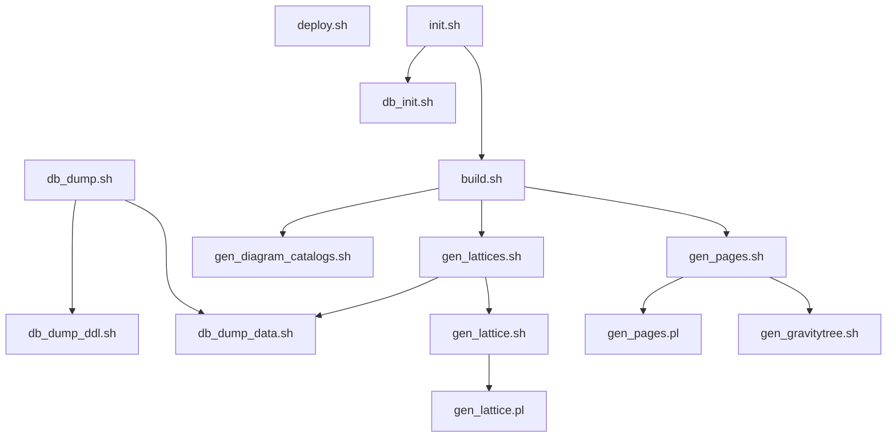

# Exploratorium

Website for the [Space-Time Theories
Exploratorium](https://remo.cua.uam.mx/vis/Exploratorium/).


## Installation

The following instructions are for a Linux Debian 12.5 (Bookworm)
installation. For other OSes and/or Linux distributions, YMMV.

Install the required packages using this command:

```sh
sudo apt install openjdk-17-jre-headless openjdk-17-jre libjson-perl \
  libtemplate-perl libdbi-perl libdbd-sqlite3-perl libdigest-md5-perl \
  libinline-java-perl pandoc sqlite3 pgformatter rsync openssh-client \
  inkscape imagemagick-6.q16 node-http-server
```

For macOS, install the equivalent packages using [Homebrew](https://brew.sh/)

Install [SQLiteStudio](https://sqlitestudio.pl/) for user-facing
database editting and manipulation, or any alternative with which you
feel comfortable.

Check [deploy.sh usage](#deploysh) for the configuration requirements
for deployment.

In the near future, [PostgreSQL](https://www.postgresql.org/) will be
supported as an alternative to [SQLite](https://www.sqlite.org/), so
in some parts of the documentation we may refer to the database
platform in an abstract fashion or mention PostgreSQL as a side note.

### Observations

* All shell scripts have been written specifically for Bash.
* If you wish to execute Conexp in stand-alone mode, as an
  application, you will need to provide a JavaFX implementation to
  Conexp, either by installing a legacy version of Java (prior to Java
  11) or installing [OpenJFX](https://gluonhq.com/products/javafx/).
* `node-http-server` is in the package list as a means to load the web
  site locally for development. If you do not wish to install its
  dependencies, you can instead use `micro-httpd` or `mini-httpd` and
  edit
  [`scripts/command/http-server.command`](scripts/command/http-server.command)
  accordingly.
* `inkscape` and `imagemagick-6.q16` are required to process and
  generate the gravity apple tree. The part executed by
  [Inkscape](https://inkscape.org/) is a typeface-sensitive operation
  and should only be done with the same architecture/machine of the
  author's, otherwise the geometries will come out wrong and the graph
  will be malformed. There is no need to install these if the gravity
  tree will not be regenerated.


## Workflow

The following is a graph of the main workflow. Trapezoids represent
files found in this GIT repo, most of which are input files. Skewed
boxes represent files resulting from the output of a process. Rounded
boxes represent user-facing applications that manipulate data. Normal
gray boxes represent a processor. Texts in italics indicate the
location of a file or the processor script/executable.


## Usage

The Exploratorium comes with a series of scripts that perform the
different transformation stages of the workflow. They are located in
the [scripts directory](scripts), inside of which there is a [commands
directory](scripts/commands) which contains the most common operations
and are meant to be executed from a file manager by double-clicking
(this functionality has been tested on macOS Finder and does not work
with GNOME Files v.43 where the best you can do is select an option by
right-clicking the .command file or installing and configuring
something like the [Command Menu
extension](https://extensions.gnome.org/extension/4850/command-menu/),
so YMMV).


### Generalities

All scripts auto-discover the location of the project directory by
assuming it to be the parent of the program's location, and they are
working-directory agnostic, meaning they can be executed from any
location and they will always act by default on the project of which
they are a part (unless `SCRIPTDIR` or `PROJECTDIR` is overriden, see
the following section).

#### Configuration and Overriding

The following environment variables can be set to customize the
transformation process:

| Name               | Default                   | Purpose                                                                                                                                                    |
|--------------------|---------------------------|------------------------------------------------------------------------------------------------------------------------------------------------------------|
| `CONFIGFILE`       | `$SCRIPTDIR/config.sh`    | Configuration override by means of a sourced shell script. If the default config file is not found, it is not sourced                                      |
| `SCRIPTDIR`        | `$(dirname "$0")`         | Location of the script being invoked                                                                                                                       |
| `PROJECTDIR`       | `$SCRIPTDIR/..`           | Location of the project's main directory                                                                                                                   |
| `DBDIR`            | `$PROJECTDIR/db`          | Location of the project's files related to the database, such as initialization SQL and data dumps, and in the case of SQLite, the database binary file    |
| `SITEDIR`          | `$PROJECTDIR/site`        | Location of the web site's files. This is the DocumentRoot for a local web server and what is deployed to production                                       |
| `DIAGRAMSUBDIR`    | `theories`                | If `DIAGRAMDIR` is not overriden, sets the sub-directory under `$SITEDIR` where diagram files will be put                                                  |
| `DIAGRAMDIR`       | `$SITEDIR/$DIAGRAMSUBDIR` | Location where the diagram files will be put                                                                                                               |
| `DIAGRAM_FILTERS`  | ` ` (no value)            | Filters (grep regexps) separated by space selecting which diagrams will be worked on. No value selects all of them. See [gen_lattices.sh](#gen_latticessh) |
| `DEFAULT_DBDSN`    | `$DBDIR/exploratorium.db` | Data store name for the database connection. DBI notation, or just the file name of an SQLite database file                                                |
| `MASTER_NAME`      | `master-%s.md`            | Name scheme for the master Markdown files found in the [tt directory](tt). %s is replaced with the language code (i.e. `en` or `es`)                       |
| `DEPLOY_HOST`      | `remo`                    | SSH Host where deployment is to connect to transfer the files of the web site. See [deploy.sh](#deploysh)                                                  |
| `DEPLOY_REMOTEDIR` | `Exploratorium`           | Path inside the deployment host where the web site files will reside. See [deploy.sh](#deploysh)                                                           |

`DEFAULT_DBDSN` can point to a file, which selects SQLite as the
database engine. DBI notation is supported for future-proofing when
the string is prefixed with `DBI:`, as per usual. If credentials are
needed, an external method such as
[pgpass](https://www.postgresql.org/docs/current/libpq-pgpass.html) is
recommended. For programs that require a connection string (a DSN) as
a parameter, `DEFAULT_DBDSN` will be taken if none is provided.

If a configuration file is found where `CONFIGFILE` points it will be
sourced and the values of the environment variables set there will
override the default values. Only when `CONFIGFILE` is using its
default value will the sourcing be ommited if the file is not
found. Otherwise, an error will be produced. 

Note: the configuration file is sourced **twice**: once before, and
once after the configuration globals are set. Complex commands within
this file are discouraged.

Example `scripts/config.sh` file:

```sh
SITEDIR=$PROJECTDIR/test-site
DIAGRAMSUBDIR=cosmo
```

This will make `SITEDIR` derive its location from `PROJECTDIR`'s
default value, and make `DIAGRAMDIR` be `$SITEDIR/cosmo`. All other
variables will take their normal default values. Since the
configuration file is in the default location, it will provoke the
overrides automatically.

Of course, you can set or export these variables at the shell level,
for a one-off case and it's the only reliable way to indicate an
alternate configuration file location:

```sh
$ CONFIGFILE=/tmp/new-config.sh scripts/init.sh
```

or if you are using a configuration file for a whole session:

```sh
$ export CONFIGFILE=$HOME/.my-exploratorium-config.sh
$ scripts/gen_diagram_catalogs.sh
$ scripts/gen_lattices.sh
```


### Execution dependencies

The whole of the project is meant to be totally or partially rebuilt
using just one command without user intervention. To understand the
execution chain, examine the following dependency tree:



All of the above programs reside in the [scripts directory](scripts).


### Top-level Operations

These are the most important programs to run while working on the
project. All of the other programs that these two invoke are specific
steps of the whole processing, but it is not really much more
productive to call them directly, so as an end-user, most of the
attention should be put on these programs, and the documentation of
the other, lower-level programs should be regarded as information for
development purposes or to isolate execution failures.

#### init.sh

This will take a project that has just been cloned from git,
[initialize the database](#db_initsh) and then [generate the whole web
site](#buildsh). It can be useful if changes to the database or other
sources have just been pulled from git and we want to regenerate the
whole thing.

This program will force the regeneration of all of the lattice files,
regardless of changes in the database. Otherwise, it's the equivalent
of just calling [db_init.sh](#db_initsh) and then
[build.sh](#buildsh), which is what is done when working in the
[database workflow](#database-workflow).

**Note: since this program invokes [db_init.sh](#db_initsh), it should
not be called if there are changes to the database that have not been
dumped back to SQL statements or these changes will be reverted to
what the SQL scripts indicate (although a backup is produced to
mitigate the damage in case this happens by accident). If there are
pending changes on the database ahd you want to see how these changes
look on the web page, use [build.sh](#buildsh)**

Invocation:

`init.sh [«DSN»]`

* `«DSN»`: optional Data Source Name, see [`DEFAULT_DBDSN`](#configuration-and-overriding).

#### build.sh

Assume the database is up and running and regenerate the whole web
site: [catalogs](#gen_diagram_catalogssh),
[lattices](#gen_latticessh) and [web pages](#gen_pagessh).

Invocation:

`build.sh [«DSN»]`

* `«DSN»`: optional Data Source Name, see [`DEFAULT_DBDSN`](#configuration-and-overriding).

Also, you can double-click or run
[scripts/commands/rebuild.command](scripts/commands/rebuild.command)
from your file browser if that is an available option.


#### deploy.sh

This program is used to upload all of `SITEDIR` to the production web
host (remo, or the value of
[`DEPLOY_HOST`](#configuration-and-overriding)). Your
`$HOME/.ssh/config` has to be correctly configured to perform the
transmission, which is done using rsync over an ssh connection for
performance: only those files that are detected as changed are
uploaded to the server.

Here is an example of an
[ssh_config](https://linux.die.net/man/5/ssh_config) section that
would make this work, assuming that the relevant asymetric keys have
been set up correctly for the default
[`DEPLOY_HOST`](#configuration-and-overriding):

```
Host remo
	Hostname remo.cua.uam.mx
	User remousr
	IdentityFile ~/.ssh/remo.rsa
```

Check any of many Internet tutorials on how to set up passwordless ssh
authentication through asymmetric keys to get everything set
up. Here's one from the University of Indiana on how to do it in [9
easy steps](https://kb.iu.edu/d/aews).

In some cases you may have to discuss ssh access and allowed
authentication methods with your production host administrator. If a
non-interactive access method is not arranged, you may have to provide
a password every time you deploy.

Invocation:

`deploy.sh`

* This program takes no arguments. Configuration is done through
  [`DEPLOY_HOST` and
  `DEPLOY_REMOTEDIR`](#configuration-and-overriding) environment
  variables.

### Database Operations

The chosen format for the database schema and data control in the git
repo is as SQL statemets. After the repository is cloned from git, the
database is not ready to be worked on: it must be restored from the
SQL scripts.

Conversely, a dump should be performed to convert the database to
plain-text SQL statement scripts for changes to be commited. SQL
output from the dump scripts is what is to be commited to the
repository, where it is easier to keep track of the changes, instead
of pushing binary files which are unnatural for git to manage.

#### Database Workflow

Here is a state diagram with the expected steps relative to working on
changes to the database:


##### Elaboration

* [db_init.sh](#db_initsh) should only be run if the database is not
  in place or if the data in the SQL files supercedes the one in the
  database. If there is work in the database pending to be dumped to
  SQL, this step should be skipped.
* Proceed to edit the database. In the future, there should be a
  [CRUD](https://en.wikipedia.org/wiki/Create,_read,_update_and_delete)
  application so that the database is not edited "by hand". For
  SQLite-based projects, we are using
  [SQLiteStudio](https://sqlitestudio.pl/).
* Run [build.sh](#buildsh) (or double-click
  [rebuild.command](scripts/commands/rebuild.command)) to regenerate
  the diagram catalogs and/or the lattice.json files as needed.
* Open the local website with your web browser and check the
  results. If the local web server is not up, firstly run
  [http-server.command](scripts/commands/http-server.command) and
  leave it there. The local server will show the access URL on the
  terminal, which should typically be <http://127.0.0.1:8080/>.
* Review your changes and go back to the database editor if more work
  needs to be done.
* If you are satisfied with the results, it's time to commit the
  canges to the git repository. Since the database is not directly
  stored on git and we are instead using SQL dumps for source control,
  run [db_dump.sh](#db_dumpsh) to export the database with the new
  data onto the SQL files.
* Proceed to commit and optionally push to git.
* If someone else has pushed changes to the SQL files, you will need
  to do a git pull, review the changes and then regenerate the
  database by running [db_init.sh](#dbinitsh) once again. This should not
  be a problem since you have already exported your own changes to the
  SQL files and reviewed any changes brought from the git pull.
  
#### Database Command Reference

##### db_init.sh

Take the SQL statements stored in `$DBDIR/ddl.sql` (SQL statements to
build the database schema) and `$DBDIR/data.sql` (data dumped as SQL
insert statements) and use them to set up a new database.

In the case of SQLite, if the database file already exists, it is
forcefully renamed to its original name plus `.bak` as an additional
suffix to avoid an irrecoverable loss of information in case there are
uncommited changes in the binary that haven't been dumped.

For DBMSes, a dump may be performed, then the database would be
dropped and recreated if possible, but this has its own caveats as
many DBs cannot be dropped if any client is connected to it.

Invocation:

`db_init.sh [«DSN»]`

* `«DSN»`: optional Data Source Name, see [`DEFAULT_DBDSN`](#configuration-and-overriding).

##### db_dump.sh

Dump both the [schema of the database](#db_dump_ddlsh) and [its
data](#db_dump_datash) and store them as SQL statements in
`$DBDIR/ddl.sql` and `$DBDIR/data.sql` respectively.

Invocation:

`db_dump.sh [«DSN»]`

* `«DSN»`: optional Data Source Name, see [`DEFAULT_DBDSN`](#configuration-and-overriding).

##### db_dump_ddl.sh

Perform a dump of the schema of the database and send it to standard
output. [`pg_format`](https://sqlformat.darold.net/) is used as a base
to beautify the output.

Invocation:

`db_dump_ddl.sh [«DSN»]`

* `«DSN»`: optional Data Source Name, see [`DEFAULT_DBDSN`](#configuration-and-overriding).

##### db_dump_data.sh

Dump the data from all of the tables and send them as INSERT SQL
statements to standard output.

Invocation:

`db_dump_data.sh [«DSN»]`

* `«DSN»`: optional Data Source Name, see [`DEFAULT_DBDSN`](#configuration-and-overriding).


### Web Site Operations

From the content creator's perspective, to render the web site's pages
and diagrams we have two main inputs: master Markdown files and the
database. For the webmaster, the template files affect the markup and
structure of the pages and of course there are CSS files, images and
Javascript sources to maintain.

The content creator needs only to invoke [build.sh](#buildsh) to
regenerate the web pages automatically after work has been done either
on the database or the master markdowns.

#### Web Content Workflow

Here is a state diagram with the expected steps for working on web
content:


##### Elaboration

* After running [build.sh](#buildsh) open the local website with your
  web browser and check the results. If the local web server is not
  up, firstly run
  [http-server.command](scripts/commands/http-server.command) and
  leave it there. The local server will show the access URL on the
  terminal, which should typically be <http://127.0.0.1:8080/>.

From here you can proceed to either:

* Work on the content of the site
  * Using a text editor, edit the master Markdown file for the desired
    language. A text editor capable of validating and previewing
    Markdown formatting is recommended.

or

* Visit a diagram page to enter editor mode and work on the lattice
  geometries.
  * The editor button will only be available if the page is visited
    through address `127.0.0.1`.
  * After altering the node positions proceed to generate the positional
    JSON code, select the "Copy" button and using a text editor replace
    the content of the corresponding `pos.json` file with what has been
    copied.
  * After the modifying the size and offset of the diagram, copy the
    corresponding value and using a text editor open the corresponding
    `config.js` and replace the value of the `VIEWBOX` parameter.

* Run [build.sh](#buildsh) and review your changes. 
* If you are satisfied with the results, it's time to commit the
  canges to the git repository and optionally git push to upload the
  changes to the upstream repository (github).
* If someone else has pushed changes to the upstream repo, you will
  need to do a git pull, review the changes and then regenerate the
  site by running [build.sh](#buildsh) once again.

#### Master Markdowns


#### Lattice Editor

#### Web Content Command Reference
